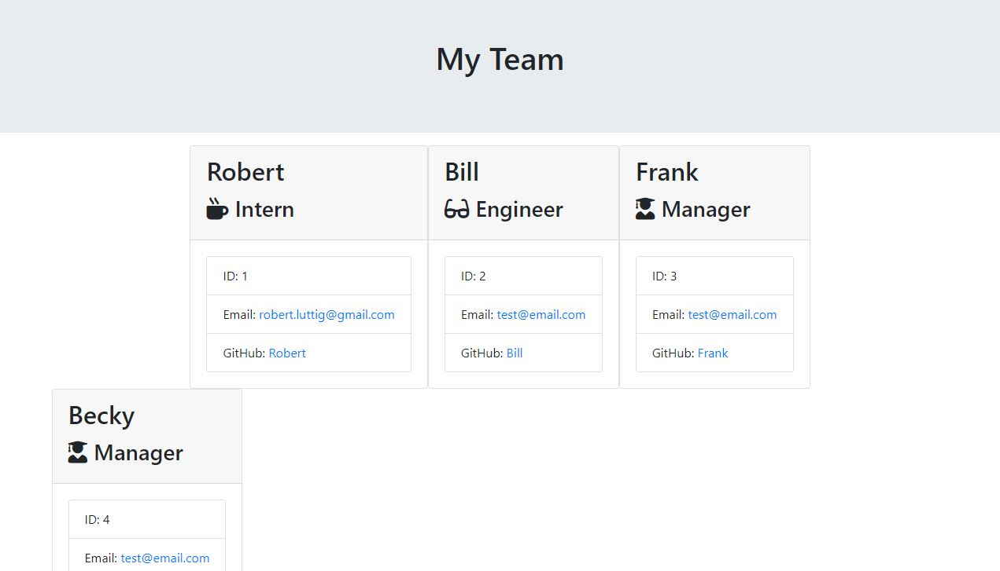

# TeamProfileGenerator
This app creates a portfolio of team members so the manager
The app creates a portfolio of team members from prompts by the user; for information about the team manager and then information about the team members. The user can input any number of team members, and they may be a mix of engineers and interns. This assignment also passes all unit Jest tests. When the user has completed building the team, the application will create an HTML file that displays formatted team roster based on the information provided by the user. 

Html file picutre of team roaster
